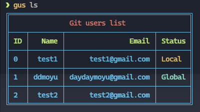

# gus

switch git user, support local and global.(切换 git 用户，支持本地和全局)



## Usage \ 使用
```bash
npm i -g @ddmoyu/gu
gus COMMAND
```

## Commands \ 命令

* `gus ls`
* `gus add`
* `gus rm`
* `gus use`

## `gus ls`
```
USAGE
 $ gus ls

DESCRIPTION
 list all users.  

EXAMPLES
 $ gus ls
  ╔═════════════════════════════════════════════╗
  ║               Git users list                ║
  ╟────┬────────┬──────────────────────┬────────╢
  ║ ID │   Name │                Email │ Status ║
  ╟────┼────────┼──────────────────────┼────────╢
  ║ 0  │  test1 │      test1@gmail.com │ Local  ║
  ╟────┼────────┼──────────────────────┼────────╢
  ║ 1  │ ddmoyu │ daydaymoyu@gmail.com │ Global ║
  ╟────┼────────┼──────────────────────┼────────╢
  ║ 2  │  test2 │      test2@gmail.com │        ║
  ╚════╧════════╧══════════════════════╧════════╝
```

## `gus add`
```
USAGE
 $ gus add

DESCRIPTION
 Add user.  

EXAMPLES
 $ gus add moyu daydaymoyu@gmail.com

 // Add moyu successfull!
```

## `gus rm`
```bash
USAGE
 $ gus rm

DESCRIPTION
 remove user.

EXAMPLES
 $ gus rm 0
 // or
 $ gus rm moyu

 // remove moyu successfull!
```

## `gus use`
```txt
USAGE
 $ gus use

DESCRIPTION
 use this user.

FLAGS
  -l   set the user as local user.(Default) \ 设置该用户为当前仓库用户。 
  -g   set the user as global user. \ 设置该用户为全局仓库用户。

EXAMPLES
 $ gus use 0 -l
 // or
 $ gus use moyu -g

 // use moyu successfull!
```

开发：
```bash
yarn dev
yarn dev ls

// or

./bin/dev
./bin/dev ls
```
